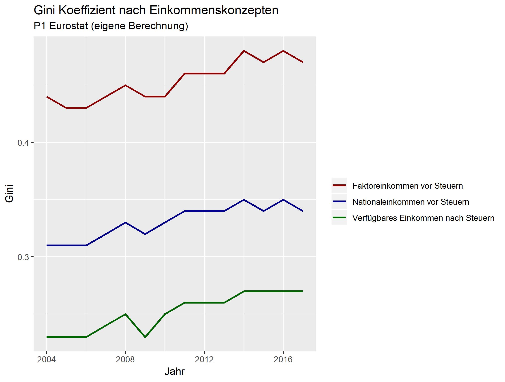
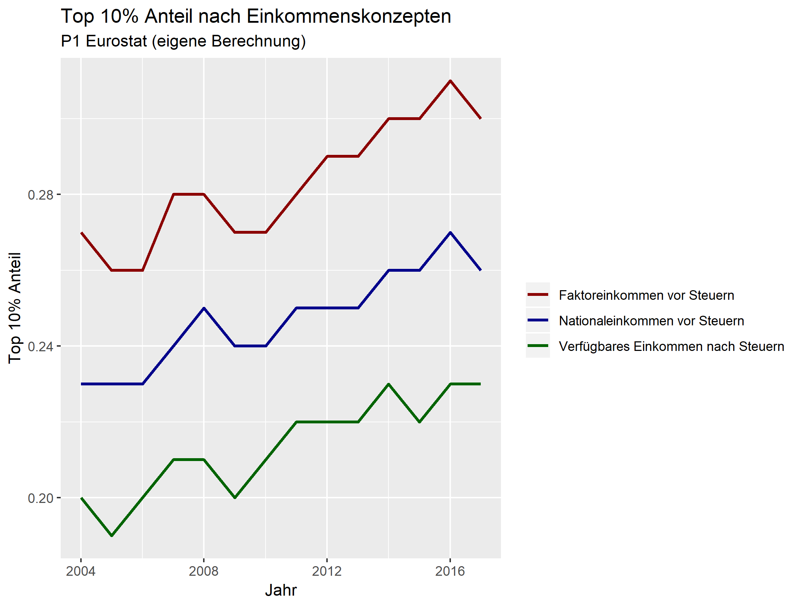
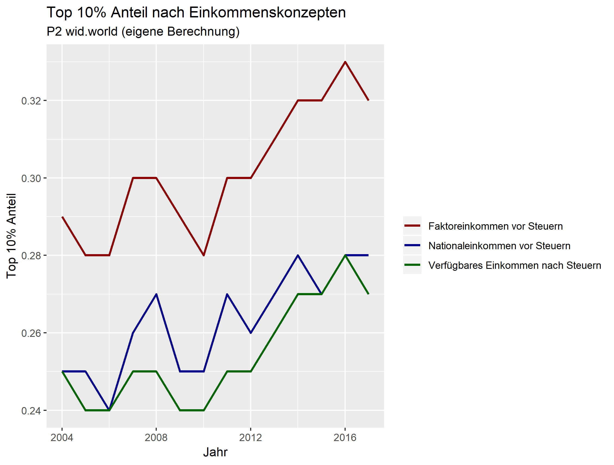
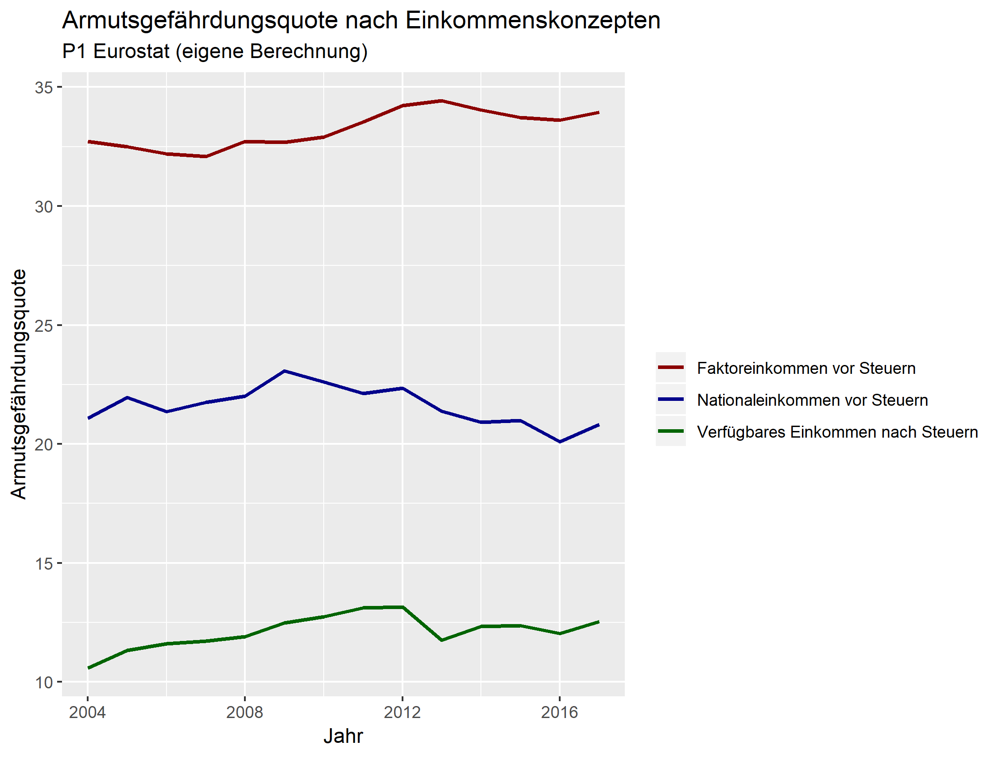
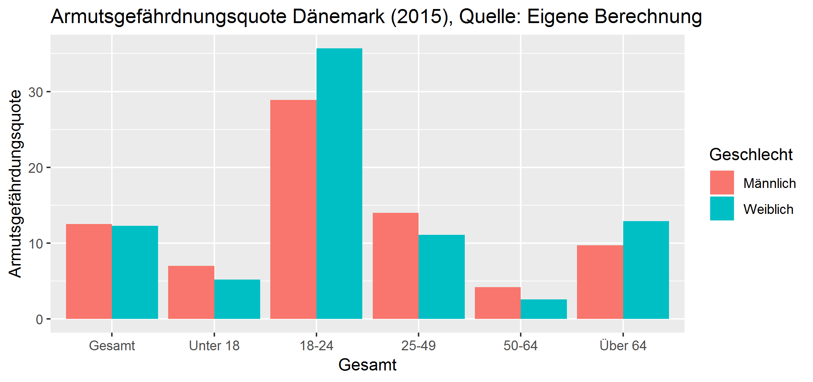

\newpage 
\tableofcontents
\newpage 
\listoffigures
\listoftables
\newpage

```{r setup, include=FALSE, message = F}
knitr::opts_chunk$set(echo = TRUE)
library(tidyverse)
```


\newpage
# 1 Einführung
Die Strategie *Europa 2020* ist die Agenda der Europäischen Union zur Förderung von Wachstum und Beschäftigung des gegenwärtigen Jahrzehntes. Zu der Umsetzung dieses geimsamen europäischen Vorhabens wurden in den Bereichen Beschäftigung, Forschung, Klimawandel, Armut und soziale Ausgrenzung  nationale Ziele festgelegt, die jährlich im Rahmen von Fortschrittsberichten beobachtet werden. Insbesondere soll durch eine Verringerung der Armut die soziale Eingliederung gefördert werden, wobei angestrebt wird mindestens 20 Millionen Menschen vor dem Risiko der Armut zu bewahren [@europe2020].

Im Rahmen dieser Vorhaben setzt die Europäische Union ein klares Zeichen zur Bekämpfung von Armut. Während Armut per se sich nur auf den untersten Teil der Einkommensverteilung bezieht, zeigt die Einkommensverteilung das Bild der gesamten betrachteten Volkswirtschaft. Seit der Jahrhundertwende haben Einkommensverteilung und Einkommensungleichheit in der Forschung zunehmend an Bedeutung gewonnen, nicht zuletzt angetrieben durch die Folgen der Finanzkrise. Die OECD weist bereits seit mehreren Jahren auf die Spreizung der Einkommen hin [@oecd2008growing; @oecd2015together]. In dem Report *Growing unequal? Income distribution and poverty in OECD countries* befasst sich die Internationale Organisation mit der Entwicklung der Disparität der Einkommen von 30 Industriestaaten und zeigt auf, dass mindestens seit der Mitte der 1980er eine geringe, jedoch kontinuierliche Erhöhung der Ungleichheit stattgefunden hat. Wird dieser Zeitaum näher betrachtet, stellt sich heraus, dass die jeweiligen Regierungen zwar ihre Ausgaben und Steuern erhöht haben um dieser Dynamik entgegenzuwirken, wohingegen der gewünschte Umverteilungseffekt nur bis Mitte der 1990er Jahre gedämpft werden konnte. In den darauf folgenden Jahren richtete sich die Umverteilungspolitik weniger gezielt auf ärmere Haushalte und führte zu einem wesentlich Anstieg der Ungleichheit. Es wird darauf hingewiesen, dass dies unter anderem ausschlaggebend für die unteschiedlichen Ausprägungen von Ungleichheit in den jeweiligen Ländern sei [@oecd2008growing]. 

Ersichtlich ist, dass eine effiziente nationale Politik Disparitäten entgegensteuern kann und Steuern und Transfers wichtige Säulen der Umverteilung sind. Dänemark wird oft als Land dargestellt, das Wirtschaftlichkeit und soziale Sicherheit erfolgreich umsetzt. Hier stellt sich die Frage, ob sich das dänische Model des Wohlfahrtsstaates auch in der nationalen Einkommensverteilung widerspiegelt. Um die Einkommensungleichheit und in diesem Zusammenhang die Entwicklung von Armut und sozialer Ausgrenzung in Dänemark sichtbar zu machen, wird eine beurteilende Analyse verschiedener Indikatoren auf Basis von ausgewählten Daten aus der *European Union Statistics on Income and Living Conditions* (EU-SILC) Erhebung im Rahmen dieses Artikels vorgenommen. 

Der erste Teil beschäftigt sich mit den institutionellen und theoretischen Grundlagen des Landes und ermöglicht es die Auswertung der Indikatoren in einen Kontext zu betrachten. Behandelt wird in diesem Zug der dänische Arbeitsmarkt und das *Flexicurity Prinzip* sowie Migration und die Folgen der Finanzkrise. Diese Einflussfaktoren sollen zu einem besseren Verständnis der länderspezifischen Ungleichheit Dänemarks beitragen. Im Rahmen von Europa 2020 wird anschließend der Fokus auf das Thema Armut und soziale Ausgrenzung gerückt. Das Kapitel Methodik befasst sich zum einen auf der Herkunft der verwendeten Daten und deren Aufbereitung sowie den verschiedenen Einkommenskonzepten, die zur Analyse herangezogen werden. Außerdem werden hier die Varianten der Zuteilung von Einkommenskomponenten auf die Haushaltsmitglieder thematisiert. Die berechneten Indikatoren in Kapitel 5 geben Auschluss über die Einkommensungleichheit und inwiefern sich Dänemark dem Ziel der Armutsbekämpfung näher. Zuletzt werden alle Erkenntnisse und Ergebnisse im Rahmen des Conclusios reflektiert und zusammengefasst.

# 2 Institutionelle und theoretische Grundlagen
Innerhalb der OECD Länder zählt Dänemark traditionell zu den gleichberechtigteren Ländern. Obwohl im Jahr 2000 der niedrigste Gini-Koeffizienten aller Länder erreicht wurde, hat die Ungleichheit in den letzten Jahren zugenommen [@atkinson2016long]. Im direkten Ländervergleich steig die Ungleichheit in Dänemark seit den 1990er Jahren schneller, sie ist aber nach wie vor auf einem sehr niedrigen Niveau [@oecd2019survey]. Zudem hat das Wachstum des Bruttoinlandproduktes in letzter Zeit dazu beigetragen, dass die obere Hälfte der Verteilung davon relativ mehr profitierte und die Umverteilungsmerkmale des Wohlfahrtssystems geschwächt wurden. Dies bestätigt auch der viel stärkere Anstieg der *Top Incomes* im Vergleich zu den anderen Dezilen [@causa2016inequality]. Veränderte Haushaltsstukturen, wie im Besonderen mehr Studenten und Single-Haushalte, steigende Einwanderung und Alterung werden als Ursachen für einen großen Teil des Anstiegs genannt [@robling2018demographic]. In einer Analyse aus dem Jahr 2016 stellte der Dänische Wirtschaftsrat fest, dass die zunehmende Ungleichheit in Dänemark auf mehrere Komponenten zurückzuführen ist: Das Arbeitseinkommen vor Steuern ist ungleicher verteilt als zuvor, das Kapitaleinkommen hat als Anteil am Gesamteinkommen zugenommen und es wird weniger stark umverteilt, denn das dänische Einkommenssteuersystem ist in den letzten 20 Jahren aufgrund einer Reihe von Steuerreformen weniger progressiv ausgerichtet worden [@danski].

Seit dem Ausbruch der Ölkrise hatte Dänemark mit anhaltend hohen Arbeitslosenquoten von rund zehn Prozent zu kämpfen. Um dieser Entwicklung entgegenzusteuern und die Arbeitslosigkeit nachhaltig zu senken, wurde das *Flexicurity* System schrittweise seit den 1990er Jahren implementiert [@bjorklund2000going]. Flexicurity ist ein Schachtelwort aus Flexibility und Security und ist zum einen durch lockere Arbeitsschutzgesetze, großzügige Arbeitslosenversicherungen und zum anderen durch eine aktive Arbeitsmarktpolitik gekennzeichnet. Ein weiteres Charakteristikum der Flexicurity Politik stellen sogenannte aktivierende Maßnahmen dar: So haben beispielsweise Arbeitlose innerhalb von drei Monaten in Zusammenarbeit mit den Behörden einen Aktionsplan für den beruflichen Wiedereinstieg zu erstellen. Außerdem können Weiterbildungsprogramme und die Annahme vermittelter Stellen, unter der Konsequenz einer Kürzung oder sogar Streichung der Arbeitslosenunterstützung bei Veweigerung, vorgeschrieben werden. Ziel dieser strikten Maßnahmen ist es die Dauer der Arbeitslosigkeit zu senken und sicherzustellen, dass die BezieherInnen bereit sind am Arbeitsmarkt zu partizipieren [@bjorklund2000going]. Zusätzlich zu den bereits genannten Reformen wurden, im internationalen Vergleich, großzügige Karenzmodelle ins Leben gerufen [@gaard2005two]. @gallen2019labor zeigt, dass im Zeitraum von 1980 bis 2010 der dänischen Arbeitsmarkt weniger geschlechterspezifisch geworden sind und die *Gender Earnings Gap* deutlich verringert hat. Letzteres beruht darauf, dass der Anteil des Lohngefälles, welcher durch Unterschiede in Bildung, Erfahrung, Beruf und Branche von Frauen im Vergleich zu Männern erklärt wird, seit den achtziger Jahren zurückgegangen ist und eine Verringerung der *Gender Hours Gap* stattgefunden hat [@gallen2019labor]. Insgesamt wendet Dänemark rund 1,8% des BIPs für aktive Arbeitsmarktpolitik auf und ist somit in diesem Punkt unter den OECD Staaten führend [@oecd2016survey].

In Folge der Finanzkrise hatte Dänemark mit beträchtlichen wirtschaftlichen Kosten zu kämpfen, da der wirtschaftliche Abschwung von 2007-2009 der schwerste seit dem Zweiten Weltkrieg war [@causa2016inequality]. Einige Schätzungen gehen davon aus, dass der gesamte Produktionsausfall in den fünf Jahren nach dem Ausbruch der Krise 12 Prozent der Bruttoinlandsproduktion ausmachte [@Jespersen]. Trotz eines starken und anhaltenden Beschäftigungsrückgangs aufgrund der Rezession, wirkten eine hohe Arbeitsplatzfluktuation und Lohnanpassungen, sodass keine langfristige und damit strukturelle Arbeitslosigkeit folgte. Dies zeigt auch eine tiefergehende Analyse: Die Zahl der von Arbeitslosigkeit Betroffenen war zwar hoch, jedoch die Dauer nur kurz, was die Auswirkungen auf die Langzeit- und Jugendarbeitslosigkeit gedämpft hatte. Dies spricht mitunter auch für das Wirken des Flexicurity Systems. Zusätzlich gab es in den letzten Jahren eine Reihe von Reformen, die es zum Ziel hatten das Arbeitskräfteangebot und die Beschäftigung, insbesondere durch Maßnahmen für junge und ältere Menschen sowie MigrantInnen, zu verbessern [@Jespersen; @causa2016inequality; @oecd2016survey]. Die Zielsetzung hierbei entspricht der zu Beginn erwähnten Analyse von @robling2018demographic. Insgesamt ist es angesichts der Probleme, die sich aus Jugendlichen und ZuwanderInnen ergeben, die mit schwachen Qualifikationen in den Arbeitsmarkt einsteigen, schwierig eine hohe Beschäftigungsquote mit einer relativ geringen Lohnstreuung zu erhalten. Da sich die meisten Jugendlichen im Sekundarbereich II, im postsekundären, nicht-tertiären oder tertiären Bereich einschreiben, besteht die Hauptherausforderung darin, die Quoten des Abschlusses zu erhöhen, um sicherzustellen, dass die Bildungsziele auch erreicht werden. Die Tragfähigkeit des Systems konnte durch eine Reihe von Reformen, wie die Erhöhung des Renteneintrittsalters und einer Verschärfung der Bedingungen zur Frühpensionierung, sichergestellt werden. Da der relative Anteil des Lebens in dem die Menschen arbeiten erhöht wird, tragen die Reformen auch verstärkt zum Wohlfahrtsstaat bei.

Wie bereits angesprochen ist ein weiterer Einflussfaktor im Kontext der Einkommensverteilung Migration. Der Flüchtlingszustrom im Jahr 2015 stellt die größte Massenbewegung in Europa seit dem Zweiten Weltkrieg dar. Mehr als die Hälfte der ankommenden Menschen beantragte Asyl am nördlichsten Rand des Kontinents: Hauptziel war bei weitem Deutschland, jedoch erhielt Schweden mehr Asylsuchende proportional zu der Bevölkerung. Die Niederlande, Norwegen und Dänemark nahmen hingegen nur wenige Asylsuchende auf. Seit dem Jahr 2000 wurde die dänische Migrationspolitik restriktiver [@joyce2018inspiration]. Nach und nach wurden unterschiedliche Regeln eingeführt, um die Asylmigration und die Familienzusammenführung einzuschränken. Die Sozialleistungen für Flüchtlinge wurden ebenfalls gekürzt und infolgedessen sank die Zahl der Asylsuchenden in Dänemark. Dennoch ist anzumerken, dass MigrantInnen eine deutlich niedrigere Beschäftigungsquote haben und insbesondere weibliche Migrantinnen stärker von Armbeitslosigkeit betroffen sind. Als Ursache hierfür wird auch die Ausgestaltung des dänischen Arbeitsmarkt, der durch hohe Mindestlöhne und eine Struktur die Erwerbsarmut ausschließt gekennzeichnet ist, genannt [@joyce2018inspiration]. Demenstsprechend sind hohe Qualifikationsanforderungen vorherrschend und niedrig qualifizierte Arbeitsplätze gelten als Mangelware. Weiters treten Sprachbarrieren, Probleme bei der Anerkennung ausländischer Bildungsabschlüsse und möglicherweise Diskriminierung auf dem Arbeitsmarkt verstärkt auf [@Jespersen]. Charakterisierend für die dänische Integrationspolitik ist die starke Involvierung von Gemeinden. Beispielsweise erhalten die Gemeinden für jeden Flüchtenden, der seine Arbeit oder eine frühzeitige Ausbildung beginnt, zusätzliche Zuschüsse [@integr; @joyce2018inspiration].

# 3 Armut und soziale Eingliederung
Artikel 25.1 der *Allgemeinen Erklärung der Menschenrechte* postuliert den Anspruch eines jeden Menschen auf ein soziales Existenzminimum und ein System der sozialen Sicherheit:

> "Jeder [Mensch] hat das Recht auf einen Lebensstandard, der seine und seiner Familie Gesundheit und Wohl gewährleistet, einschließlich Nahrung, Kleidung, Wohnung, ärztliche Versorgung und notwendige soziale Leistungen gewährleistet sowie das Recht auf Sicherheit im Falle von Arbeitslosigkeit, Krankheit, Invalidität oder Verwitwung, im Alter sowie bei anderweitigem Verlust seiner Unterhaltsmittel durch unverschuldete Umstände." [@Menschenr]

Insbesondere sind in diesem Kontext Menschen, die über keinen entsprechenden Lebensstandard verfügen und von Ungleichheit oder Armut betroffen sind, von Interesse. Die Komplexität des Begriffes Armut sollte hierbei noch hervorgehoben werden, da dieser sehr vielfältig konnotiert ist und nicht einheitlich verwendet wird [@bammer2003armut]. Monetäre Armut stellt wohl die offensichtlichste Form von Armut dar. Personen gelten nach EU Definition als monetär arm, wenn ihr Einkommen nach Sozialleistungen weniger als 60% des Medians beträgt. Nur monetäre Armut zu berücksichtigen, wäre jedoch zu kurz gegriffen. Es ist durchaus denkbar, dass eine Person nicht als monetär arm gilt und dennoch nicht in der Lage ist, einen gewissen Mindeststandard an materiellem Wohlstand zu bestreiten. Hierbei spricht man von materieller Deprivation. Konkret gilt als materiell depriviert, wer vier der folgen Punkte nicht finanzieren kann: Miete,  Betriebskosten, Reparaturen, Kreditraten; sein oder ihr Zuhause warm zu halten; unerwartete Ausgaben; jeden zweiten Tag Fleisch, Fisch oder ein anderes proteinreiches Nahrungsmittel zu essen; einen einwöchigen Urlaub pro Jahr; ein Auto; eine Waschmaschine; einen Farbfernseher; ein Telefon. Da sich aber auch der Zugang zum Arbeitsmarkt auf die Möglichkeit zur sozialen Teilhabe auswirkt, werden ebenso Personen berücksichtigt, welche in einem Haushalt mit sehr niedriger Erwerbsintensität leben. Als solche bezeichnet man Haushalte, in denen Personen im erwerbsfähigen Alter weniger als 20% der potenziellen Zeit arbeiten [@europe2020].

Somit wird ersichtlich, dass die Messung von Armut und sozialer Ausgrenzung eines mehrdimensionalen Konstruktes bedarf. Gewiss hat das (monetäre) Einkommen per se einen starken Einfluss auf die Lebensbedingungen und die Möglichkeit zur sozialen Teilhabe, jedoch müssen noch weitere Faktoren berücksichtigt werden um ein differenziertes Bild zu erhalten. Dementsprechend werden im Rahmen der *Strategie Europa 2020* Personen als von Armut und sozialer Ausgrenzung gefährdet definiert, wenn sie von einem der folgenden drei Umstände betroffen sind: Monetäre Armut, soziale Deprivation oder sehr niedrige Erwerbsintensität [@europe2020].

Maßnahmen, welche gegen Armut und Ungleichheit in Dänemark vorzugehen, orientieren sich vorwiegend an der Strategie Europa 2020, einer wirtschaftspolitischen Vorgehensweise der Europäischen Union. Diese soll für eine soziale Marktwirtschaft sowie für nachhaltiges Wachstum und solide öffentliche Haushalte Sorge tragen. In diesem Zug wurden fünf Kernziele in den Bereichen Beschäftigung, Forschung, Klimawandel, Armut und soziale Ausgrenzung festgelegt, welche in den jeweiligen Mitgliedsstaaten in nationale Reformziele umgesetzt und vom Basisjahr 2008 ausgehend bis zum Zieljahr 2020 erreicht werden sollen [@europe2020]. Wie bereits angesprochen, stellt die Reduktion von Armut und sozialer Ausgrenzung eines der zentralen Ziele der Strategie Europa 2020 dar. Ziel der EU ist es, die Zahl der von Armut oder sozialer Ausgrenzung gefährdeten Personen bis 2020 um 20 Millionen zu senken [@eudenm]. Im Jahr 2016 waren in der EU 118 Millionen Personen von Armut oder sozialer Ausgrenzung betroffen, das entspricht rund einem Viertel der Bevölkerung. In Dänemark lag dieser Wert bei einer Million, oder rund 17% der Bevölkerung [@oecdpop]. 

Um den nationalen Besonderheiten gerecht zu werden, können einzelne Staaten für Europa 2020 besondere Schwerpunkte setzen. Dänemark legt dabei ein besonderes Augenmerk auf Personen, die in Haushalten mit sehr niedriger Erwerbsintensität leben und möchte die Zahl dieser bis 2020 um 22.000 senken [@europe2020]. Im Jahr 2016 lebten noch eine Million der Däninen und Dänen in Haushalten mit sehr niedriger Erwerbsintensität [@eurostatweb]. Die nationale Zielsetzung ist auch im Sinne des Fexicurity Prinzips, da darauf abgezielt wird einen möglichst großen Teil der Bevölkerung in den Arbeitsmarkt zu integrieren. Ein weiteres konkretes Ziel der Dänischen Regierung, welches im Rahmen von Europa 2020 gesetzt wurde und eng mit Armut und sozialer Eingliederung in Verbindung steht, ist die Erhöhung der Chancengleichheit, um den sozialen Zusammenhalt in der Gesellschaft zu stärken. Zu diesem Zweck wurde bereits 2001 ein Sozialfonds eingerichtet, der sozialer Vererbung entgegenwirken und sozial schwache Gruppen unterstützen soll. Zu diesen Gruppen zählen unter anderem auch Kinder und Jugendliche in präkerer Lage. Um dieses Ziel zu erreichen plant die dänische Regierung die Zivilgesellschaft und den Einsatz von Freiwilligenarbeit zu stärken und finanziell zu unterstützen, Obdachlosigkeit zu bekämpfen, präzise Armutsindikatoren zu entwickeln, sowie Strategien in Bezug auf Ghettoisierung und Drogenmissbrauch zu entwickeln. Das Budget für diese Maßnahmen umfasst jährlich rund eine Milliarde Dänische Kronen. Das entspricht rund 130 Millionen Euro oder knapp 5 Prozent des dänischen Bruttoinlandsprodukts [@denmark2020].

Insgesamt ist der Anteil der von Armut oder sozialer Ausgrenzung betroffenen Personen an der Bevölkerung in Dänemark im internationalen Vergleich niedrig. Außerdem zeigt sich in der Differenz der Armutsgefährdungsquoten vor und nach Steuern aus dem Jahr 2014, dass knapp 15% der monetären Armut durch Sozialausgaben überwunden wird, wohingegen der EU-weite Wert bei knapp 9% liegt [@europe2020]. 

# 4 Methodologie
## 4.1 Daten 
Für eine Analyse liefert die Erhebungen *European Union Statistics on Income and Living Conditions* (EU-SILC) hinreichend detaillierte Daten. Ausschließlich für die Inflationsbereinigung werden Daten von dem *Statistischen Amt der Europäischen Union* (Eurostat) herangezogen. Erstmals wurde die EU-SILC Erhebung 2003, basierend auf einer freiwilligen Vereinbarung zwischen Eurostat und sechs EU-Mitgliedstaaten (Belgien, Dänemark, Griechenland, Irland, Luxemburg und Österreich) sowie Norwegen durchgeführt. Inzwischen beteiligen sich neben den EU-Mitgliedsstaaten auch Norwegen, Island, die Türkei, die Schweiz, Mazedonien und Serbien an der harmonisierten Stichprobenerhebung von privaten Haushalten [@eurostatweb]. Das Hauptaugenmerk der Erhebung liegt in der Beobachtung von Armut und sozialer Ausgrenzung und dient in diesem Kontext zur Überwachung der Strategie Europa 2020. 

Generell werden multidimensionale Mikrodaten zu Einkommen, Armut, sozialer Ausgrenzung, Wohnraum, Arbeit, Bildung und Gesundheit erfasst. Es handelt sich hierbei zum einen um *Querschnittsdaten* über einen bestimmten Zeitpunkt und zum anderen *Längsschnittdaten*, welche Veränderungen auf individueller Ebene über einen gewissen Zeitraum beobachten [@silcmanual]. Anzumerken ist, dass aufgrund der engen Definition von Haushalten, Personen die in Anstaltshaushalten oder Gemeinschaftsunterkünften leben oder ohne festen Wohnsitz sind nicht in den Daten erfasst werden.

Wie bereits angeführt, nimmt Dänemark seit der Erstherbung an der EU-SILC Erhebung teil. Hervorzuheben ist, dass Dänemark sowie die restlichen nordischen Länder, Holland und Slowenien zu den einzigen Ländern gehören, in welchen die Einkommensstatistiken auf vollständigen Registern basieren [@statdenm]. Die von der nationalen Statistikbehörde *Danmarks Statistik* durchgeführte primärstatistische Erhebung wird sowohl mit Hilfe von persönlichen (*Computer Assisted Personal Interview*) und telefonischen (*Computer Assisted Telephone Interview*) Interviews als auch durch computergestützte (*Computer Assisted Web Interviews*) Webinterviews realisiert. Im Jahr 2012 präsentierte Danmarks Statistik erstmals seine Erfahrung mit der Verwendung von Computer Assisted Web Interviews (CAWI) für subjektive Variablen im Rahmen der Erhebung [@cawi]. Für diese Arbeit sind die nach CAWI-erhobenen Daten jedoch nicht relevant, da diese in der Pilotphase nur die Variablen PW010, HS120, HS040 und HS060 betreffen [@cawistat].

Die Daten, welche im Rahmen des EU-SILC erhoben werden, müssen zunehmend dem Anspruch gerecht werden international vergleichbar zu sein. Da die Primärerhebungen aber von den jeweiligen nationalen Behörden durchgeführt werden und diese unterschiedliche Definitionen und Konzepte verwenden, ergibt sich das Problem, dass diese Vergleichbarkeit in vielen Fällen nicht gewährleistet ist. Ein derartiges Spezifikum der dänischen Statistikbehörde Danmarks Statistik besteht darin, dass Einkommen auch negative Werte annehmen können und dies in Dänemark auch häufig zutrifft [@atkinson2010income]. Da diese Vorgehensweise in den meisten anderen Ländern nicht üblich ist und äquivalisierte Einkommen sowie einige Verteilungsmaße nur für positive Werte interpretierbar sind, werden im Rahmen dieser Arbeit nur positive Einkommen berücksichtigt.

## 4.2 Einkommenskonzepte
Im Rahmen der Analyse der Einkommensverteilung in Dänemark werden folgende drei Einkommenskonzepte verwendet, um etwaige Unterschiede in der Entwicklung der Indikatoren besser zu verfolgen und Rückschlüsse auf die Herkunft etwaiger Veränderungen der Lebensbedingungen zu ziehen (detaillierte Beschreibungen der jeweiligen Variablen sind von *Gesis*[^fußnote] einsehbar):

[^fußnote]: https://www.gesis.org/en/missy/metadata/EU-SILC/ 

**1. Faktoreinkommen vor Steuern**
Das vorsteuerliche Faktoreinkommen setzt sich aus der Summme aus Arbeitseinkommen inklusive Selbstständiger (PY010G, PY021G, PY050G, HY110G) und Vermögenseinkommen (HY040G, HY090G, PY080G) zusammen. Dieses Einkommenskonzept erfasst somit nur die Einkommen aus aktiver Produktion. Unter der Annahme, dass kein Transfersystem existiert, wird durch die Betrachtung des vorsteuerlichen Faktoreinkommens eine direkte Verbindung zu den Arbeitsmärkten geschaffen.


**2. Nationaleinkommen vor Steuern**
Das Nationaleinkommen vor Steuern inkludiert neben den Komponenten des Faktoreinkommens vor Steuern  noch Pensionen (PY100G) und Arbeitslosengeld (PY090G). In diesem Einkommenskonzept werden nur arbeitsrelevante Transferzahlungen hinzugezogen, um eine etwaige Verzerung aufgrund von Veränderungen in der Altersstrukturen (Personen in Pension mit keinem beziehungsweise geringem Faktoreinkommen) zu berücksichtigen. Unterschiede in der Entwicklung von Faktoreinkommen vor Steuern und Nationaleinkommen vor Steuern legen Reformen im Bereich der Arbeitslosen- beziehungsweise öffentlichen Pensionsversicherung nahe. 


**3. Verfügbares Einkommen nach Steuern**
Das verfügbare Einkommen nach Steuern inkludiert neben den Komponenten des Nationaleinkommens vor Steuern alle anderen erhaltenen Transferzahlungen (PY110G, PY120G, PY130G, PY140G, HY050G, HY060G, HY070G, HY080G) abzüglich aller direkten Steuern und Sozialversicherungsabgaben (HY120G, HY130G, HY140G). Schließlich zeigt das verfügbare Einkommen nach Steuern wie der Staat die Höhe und Verteilung der verfügbaren Einkommen durch (weitere) monetäre Transfers beeinflussen kann. 

Zu beachten ist, dass es über die Jahre zu Änderungen in der Definition der EU-SILC Daten kam. Dementsprechend ist ein uneingeschränkter Vergleich zwischen den Jahren nicht möglich, dennoch lassen sich daraus interessante Entwicklungen ableiten.


## 4.3 Allokation der Haushaltskomponenten
Wie aus den oberen Konzepten erkenntlich, gibt es sowohl Variablen auf Personen- (PY010G) als auch Haushaltsebene (HY110G). Die Einkommenskomponenten beziehungsweise Steuern, die nur auf Haushaltsebene verfügbar sind, werden auf die einzelnen Haushaltsmitgleider aufgeteilt. Die Allokation erfolgt nach folgenden zwei Aufschlüsselungsmethoden:

**1. P1 Eurostat ** Hierbei werden alle Einkommen eines Haushaltes in gleichem Maß auf die äquivalten Haushaltsmitglieder aufgeteilt.

**2.  P2 wid.world ** Im Gegensatz zu der vorhergehenden Variante, werden hier nicht mehr alle in einem Haushalt lebenden Personen in das Sample genommen. Hier erfolgt eine Ausschließung von Personen unter 20 Jahren. Außerdem werden lediglich die Einkommensvariablen, die nur auf Haushaltsebene verfügbar sind, gleichmäßig durch die Anzahl der Haushaltsmitglieder (>20) auf alle Haushaltsmitgleider aufgeteilt; die persönlichen Einkommen bleiben den jeweiligen Personen vorbehalten. 

# 5 Empirische Analyse
Im Folgenden wird die Einkommensverteilung in Dänemark anhand von mehreren standardisierten Indikatoren für den Zeitraum 2004-2017 analysiert, um Rückschlüsse über die Ungleichheit des Landes zu geben. Hierbei ist es von Interesse die verschiedenen Einkommenskonzepte differenziert zu betrachten und die jeweiligen Veränderungen in der Verteilung der Einkommen zu beobachten. Weiters ist festzuhalten, dass es keinen idealen Indikator gibt. Vielmehr spiegelt jeder Indikator für sich unterschiedliche Aspekte der Einkommensverteilung wider und erst eine Analyse, unter Einbeziehung aller Maße, ermöglicht eine abschließende Beurteilung.

In diesem Abschnitt liegt der Fokus der Auswertung auf P1. Begründet wird dies dadurch, dass die Steuerdaten nur auf Haushaltsebene verfügbar sind. Würden wir beispielsweise die Variante P2 heranziehen, wenn wir eine geringverdienende Frau mit sehr gut verdienenden Mann betrachten, stellt sich heraus, dass sie neben ihrem geringen Einkommen die Steuerlast ihres Mannes in der Einkommensverteilung mitträgt. Sämtliche Gesamtübersichten der berechneten Indikatoren befinden sich für beide Allokationsvarianten, sprich P1 Eurostat und P2 wid.world, im Appendix.

## 5.1 Mittelwert und Median
Für einen ersten Eindruck, werden der Median und der Mittelwert der Einkommen näher betrachtet, da diese Aufschluss über die Schiefe der Verteilungsfunktion geben. Abbildung 1 zeigt die Entwicklung der beiden Indikatoren nach dem verfügbaren Einkommen nach Steuern seit 2004.

{width=70%}

Es  fällt  sofort  ins  Auge, dass beide Werte über den Zeitverlauf stark gestiegen sind. Die Betrachtung des durchschnittlichen Jahreseinkommen zeigt von 2004 bis 2017 eine Erhöhung von rund 28.371 DKK auf 33.776 DKK, was knapp 20% entspricht. Ein Anstieg des durchschnittlichen Einkommens zeigt jedoch nicht, welchen Teilen der Bevölkerung dieser Anstieg zugute gekommen ist und lässt dementsprechend keine Rückschlüsse über die Verteilung der Einkommen zu. Außerdem ist anzumerken, dass dieses Maß anfällig für statistische Verzerrungen sein kann (sehr hohe Einkommen verzerren das Durchschnittseinkommen nach oben). Insgesamt stieg das Medianeinkommen in Dänemark im beobachteten Zeitraum um rund 15%, etwas schwächer also, als das Durchschnittseinkommen. Da das Durchschnittseinkommen deutlich über dem Medianeinkommen liegt, kann man daraus schließen, dass die Einkommensverteilung eine rechtsschiefe Dichtefunktion ausweist. Dies ist charakteristisch für eine Einkommensverteilung. Der Umstand, dass der Unterschied zwischen Durchschnitt und Median gewachsen ist, bedeutet, dass heute ein größerer Anteil der Bevölkerung niedrige Einkommen bezieht, als im Jahr 2004. Dies kann als Anstieg der Ungleichheit interpretiert werden. Weiters ist aus der Abbildung gut ersichtlich, dass Dänemark nicht unverschohnt von dem wirtschaftlichen Abschwung 2007-2009 geblieben ist und sich dieser durchaus negativ auf die Einkommen privater Haushalte ausgewirkt hat (Vgl. Kapitel 2).

## 5.2 Gini Koeffizient
Der Gini-Koeffizient, misst inwieweit die Einkommensverteilung innerhalb eines Landes von einer vollkommen gleichen Verteilung abweicht. Entspricht der Gini einem Wert von Null, liegt eine vollständige Gleichverteilung vor, nimmt er 1 an, so gehört einer Person das ganze Einkommen innerhalb der Gesellschaft [@statexpl2]. 

{width=70%}

Abbildung 2 zeigt die Entwicklung des Gini Koeffizienten nach allen Einkommenskonzepten seit dem Jahr 2004. Klar ersichtlich ist, dass  die  staatlichen Umverteilungssysteme die Einkommensungleichheit stark sinken lassen. Dies wird durch den Vergleich des Ginis für das verfügbare Einkommen nach Steuern mit den beiden anderen Einkommenskonzepten ersichtlich. Sowohl Arbeitslosenunterstützung und Pensionen als auch Steuer- und Transfersysteme lassen die Ungleichheit in einem größeren Ausmaß sinken. Daraus wird ersichtlich, dass der dänische Staat durch Sozialleistung und Transfers eine starke Umverteilung der Einkommen bewirkt. Für das Jahr 2017 bedeutet dies eine absolute Senkung des Koeffizienten von insgesamt 20%. Der Vergleich von 2004 zeigt jedoch, dass die Ungleichheit für Dänemark gestiegen ist und sich der Koeffizient auf seinem Spitzenwert befindet. In dem Einkommenskonzept P2 (Vgl. Tabelle 3, Appendix) kommen deutlich höhere Werte für den Gini Koeffizienten des verfügbaren Einkommens nach Steuern hervor. Dies ist einerseits naheliegend, da nach dem Einkommenskonzept P1 die Einkommen in gleichem Maß auf alle Haushaltsmitglieder aufgeteilt werden und andererseits die Aufteilung der Steuerlast auf die Haushaltsmitglieder zu Verzerrungen führen kann.

## 5.3 P80/P20 Verhältnis
Die Bezeichnungen des P80/P20 Verhältnisses leiten sich von dem achtzigsten beziehungsweise zwanzigsten Perzentil ab. Das achtzigste ist jener Wert unter dem 80% aller Einkommen liegen. Folglich liegen 20% der Einkommen über diesem Wert. Das Verhältnis beider ist der Quotient aus der Summe der Einkommen über dem achtzigsten Perzentil und der Summe der Einkommen unter dem zwanzigsten Perzentil [@statexpl]. Somit liegt der Fokus, im Kontrast zum Gini-Koeffizienten, auf den beiden äußeren Rändern der Einkommensverteilung. 

{width=80%}

Um das P80/P20 Verhältnis für Dänemark zu illustrieren, werden die drei verschiedenen Einkommenskonzepte über den Zeitrahmen 2004-2017 in Abildung 3 betrachtet. Unter der Annahme, dass der mittlere Einkommensteil in diesem Verhältnis ausgeblendet wird, ist dieses Maß wesentlich sensitiver bei Veränderungen an den Rändern der Verteilung. Besonders auffallend ist der enorme Unterschied zwischen Faktor- und Nationaleinkommen. Dies kann ein Ausdruck für eine stärkere Umverteilungswirkung von Pensions- und Arbeitslosengeld insbesondere an den Rändern der Verteilung sein. Noch deutlicher wird dieser Effekt in dem Einkommenskonezpt P2 (Vgl. Tabelle 4, Appendix). Für die verfügbaren Einkommen beträgt das P80/P20 Verhältnis im Jahr 2017 für P1 rund 4. Dies bedeutet, dass eine Person aus den Top 20% im Durchschnitt das Vierfache des Einkommens einer Person der unteren 20% verdient. Seit 2004 lässt sich insgesamt ein leicht steigender Trend zu mehr Ungleichheit in beiden Allokationsvarianten feststellen.

## 5.4 Top 10% Anteil
Der Top 10% Prozent Anteil ist der Qutient aus der Summe der Einkommen über dem neunzigsten Perzentil und der Summe aller Einkommen. Er gibt Auskunft darüber, welcher Anteil des gesamten Einkommens an die bestverdienensten 10% der Bevölkerung fließt.

<!-- {width=100%} -->
{width=50%}


Abbildungen 4 und 5 zeigen die Entwicklung des Top 10% Anteils nach den drei Einkommenskonzepten für beide Allokationsvarianten. Der Anteil der Top 10% ist für die jeweiligen Einkommenskonzepte im Zeitverlauf leicht steigend. Für die verfügbaren Einkommen nach P1 lag dieser Wert 2017 bei 23%. Dies bedeutet, dass die Top-Verdiener circa ein Viertel des Gesamteinkommens bezogen. Bei der Berechnung nach P1 ist eindeutig erkennbar, dass sowohl Pensionen und Arbeitslosenunterstützung, als auch alle anderen Transfers den Anteil der Top 10% senken. 

{width=50%}

Bei der Berechnung nach P2 ist dieser Effekt zwar für Pensionen und Arbeitslosenunterstützung sichtbar, weniger deutlich ist er jedoch für alle anderen Transfers. Im Gegensatz zu den anderen Indikatoren ist beim Anteil der Top 10% der Unterschied zwischen P1 und P2 vergleichsweise niedrig.

## 5.5 Armutsgefährdungsquote
Die Armutsgefährdungsquote umfasst den Anteil jener Personen, deren Äquivalenzeinkommen weniger als 60% des Medians der Äquivalenzeinkommen der Bevölkerung beträgt. Abbildung 6 zeigt die Entwicklung der Armutsgefährdungsquote nach den verschiedenen Einkommenskonzepten von 2004-2017.

{width=70%}

Unter alleiniger Betrachtung der verfügbaren Einkommen nach Steuern ist ersichtlich, dass die Armutsgefährdungsquote von 10,6% im Jahr 2004 auf 12,5% im Jahr 2017 gestiegen ist. Zwar kann Dänemark im EU-Vergleich eine gerine Armutsgefährdungsquote per se aufweisen, dennoch bewegt sich das Land noch nicht in die richtige Richtung für die Strategie Europa 2020. Dies bedeutet, dass die Zielvorgaben die bis 2020 erfüllt werden sollen, in weitere Ferne rücken. Dementsprechend wird auch die nationale Zielsetzung der Senkung der niedriger Erwerbsintensität für Dänemark schwieriger umsetzbar. Dennoch gilt es zu bemerken, dass die Armutsgefährdungsquote in Dänemark vergleichsweise niedrig ist und Dänemark in der Tat in der Lage ist, die Armutsgefährdungsquote durch Umverteilungsmaßnahmen niedrig zu halten. Würden sämtliche Transferleistungen wegfallen, läge die Armutsgefährdung bei rund einem Drittel. Im Falle eines Wegfalles von Pensions- und Arbeitslosengeld, wären noch immer 20% der dänischen Bevölkerung armutsgefährdet. Verglichen mit dem Top 10% Anteil zeigen sich deutlichere Unterschiede zwischen den Einkommenskonzepten P1 und P2. Dies legt nahe, dass in den ärmeren Haushalten die Einkommen ungleicher verteilt sind.

&nbsp;

**Zerlegung der Armutsgefährdungsquote**

Um einen besseren Eindruck davon zu gewinnen, welche Personengruppen besonders von Armut gefährdet sind, wurden außerdem Armutsgefähdrungsquoten nach Alter und Geschlecht für das Jahr 2015 berechnet.

{width=90%}

Die Abbildung zeigt die Ergebnisse dieser Aufschlüsselung und im Appendix befinden sich in Tabelle 7 die exakten Werten. Aus der Aufschlüsselung ist ersichtlich, dass insbesondere Personen zwischen 18 und 24 Jahren von Armut gefährdet sind. Nach den hier durchgeführten Berechnungen ist dies bei 35,7% der Frauen und 28,9% der Männer im Alter zwischen 18 und 24 Jahren der Fall. Somit stellen Frauen im Alter zwischen 18 und 24 Jahren die am stärksten armutsgefährdete Gruppe dar. Hierbei ist festzuhalten dass diese Kennzahlen mit äquivalisierten Einkommen berechnet wurden, wodurch in einem Haushalt entweder alle Personen armutsgefährdet sind oder niemand. Eurostat hingegen verwendet Personeneinkommen und schließt die Möglichkeit einzelner armutsgefährdeter Personen in einem Haushalt mit ein. Dieser methodische Unterschied spiegelt sich auch in den Resultaten wider. Besonders groß ist der Unterschied bei Männern zwischen 18 und 24 Jahren; die von Eurostat berechnete Armutsgefährdungsquote beträgt für diese Gruppe 36,3%. Insgesamt zeigen sich jedoch auch in den von Eurostat berechneten Werten, dass Frauen im Alter zwischen 18 und 24 Jahren von Armutsgefährdung betroffen sind. Dies stimmt auch mit den Ergebnissen der Literaturübersicht überein.

Anzumerken ist, dass die durchgeführte Zerlegung die Armutsschichten in Dänemark nicht vollständig darstellen kann. Hierfür wäre eine umfangreichere und komplexere Analyse der Haushaltsstruktur notwendig.


# 6 Conclusio
Im Rahmen von der Strategie Europa 2020 hat Dänemark Maßnahmen, welche gegen Armut und Ungleichheit vorgehen, festgelegt. Zusammenfassend lässt sich sagen, dass die Ungleichheit in Dänemark grundsätzlich niedrig, im speziellen Beobachtungszeitraum, 2004-2017, jedoch leicht gestiegen ist. Dabei gilt es zu betonen, dass deutliche Unterschiede zwischen verschiedenen Einkommenskonzepten und Allokationsmechanismen bestehen. Diese Unterschiede sind jedoch nicht als Fehler zu interpretieren, sondern vielmehr müssen verschieden Konzepte angewendet werden, um der Komplexität der Materie der Einkommensverteilung gerecht zu werden. Insgesamt zeigen sämtliche Ergebnisse die starke umverteilende Wirkung des dänischen Transfer- und Steuersystems. Ohne diesen Mechanismus wären die Einkommen in Dänemark deutlich ungleicher verteilt. Dieses Ergebnis ist im Einklang mit dem aktuellen Stand der Forschung und dem internationalen Trend [@oecd2016survey, @causa2016inequality]. Die genauen Ursachen für diese Entwicklung lassen sich mit den vorliegenden Daten vermutlich nicht ausreichend identifizieren. Fest steht jedoch, dass die schrittweise Verschärfung der Bestimmungen zur Arbeitslosenunterstützung und damit der Rückgang der BezieherInnen von Arbeitslosenunterstützung mit einem Anstieg an SozialhilfeempfängerInnen und FrühpensionistInnen einherging [@gaard2005two, @oecd2016survey]. Es liegt nahe, dass das Flexicurity System Dänemarks und die einhergehenden Reformen, das Problem der Arbeitslosigkeit nur oberflächlich lösen. Außerdem ist die Armutsgefährdungsquote in dem Beobachtungszeitraum, entgegen der gewünschten Entwicklung Richtung Europa 2020, gestiegen. Durch eine Zerlegung konnte festgestellt werden, dass insbesondere 18-24 Jährige und unter diesen speziell Frauen von Armutsgefährdung betroffen sind. Auch dieses Ergebnis deckt sich mit der bestehenden Literatur [@oecd2016society]. 

Anzumerken ist, dass die Ergebnisse dieser Arbeit nur einen kleinen Teil der Einkommensungleichheit und Armut in Dänemark repräsentieren. Für eine tiefergehende Analyse bedarf es noch mehr Forschung und zusätzliche Daten. Besonders interessant wäre in diesem Sinne eine genauere Betrachtung der Haushaltsstruktur.
\newpage

# Appendix
**Legende**

- **P1fakt:** Faktoreinkommen vor Steuern nach P1 Eurostat (eigene Berechnung)
- **P1nat.:** Nationaleinkommen vor Steuern nach P1 Eurostat (eigene Berechnung)
- **P1verf.:** Verfügbares Einkommen nach Steuern nach P1 Eurostat (eigene Berechnung)
- **P2fakt.:** Faktoreinkommen vor Steuern nach P2 wid.world (eigene Berechnung)
- **P2nat.:** Nationaleinkommen vor Steuern nach P2 wid.world (eigene Berechnung)
- **P2verf.:** Verfügbares Einkommen nach Steuern nach P2 wid.world (eigene Berechnung)
- **ESfakt.:** Eurostat Faktoreinkommen vor Steuern 
- **ESverf.:** Eurostat verfügbares Einkommen nach Steuern

&nbsp;

**Gesamtübersichten der Indikatoren**
```{r echo=FALSE, message = F, warning=F}
load("tables/frame_meana.Rda")
knitr::kable(frame_meana, caption = "Gesamtübersicht Mittelwert")
```

```{r echo=FALSE, message = F, warning=F}
load("tables/frame_mediana.Rda")
knitr::kable(frame_mediana, caption = "Gesamtübersicht Median")
```


```{r echo=FALSE, message = F, warning=F}
load("tables/frame_ginia.Rda")
knitr::kable(frame_ginia, caption = "Gesamtübersicht Gini-Koeffizienten")
```


```{r echo=FALSE, message = F, warning=F}
load("tables/frame_8020a.Rda")
knitr::kable(frame_8020a, caption = "Gesamtübersicht P80/P20 Verhältnis")
```


```{r echo=FALSE, message = F, warning=F}
load("tables/frame_t10sa.Rda")
knitr::kable(frame_t10sa, caption = "Gesamtübersicht Top 10% Anteil")
```


```{r echo=FALSE, message = F, warning=F}
load("tables/frame_arpra.Rda")
knitr::kable(frame_arpra, caption = "Gesamtübersicht Armutsgefährdungsquote")
```


```{r echo=FALSE, message = F, warning=F}
load("tables/arpr_tab_appendix.Rda")
knitr::kable(arpr_tab_appendix, caption = "Vergleich Armutsgefährdungsquote")
```

\newpage
# Literatur
<!-- Leer lassen -->