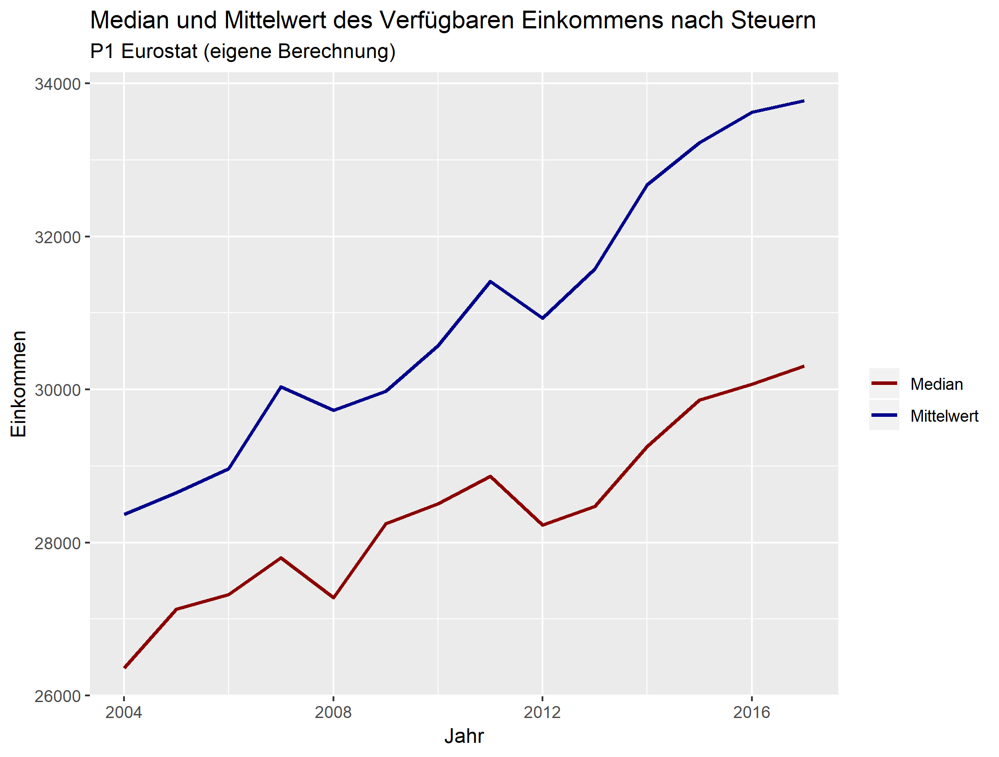
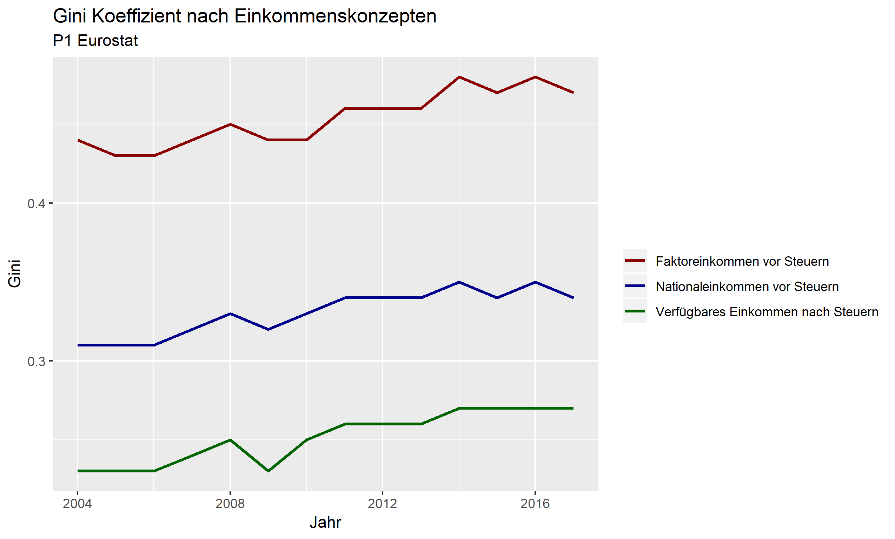
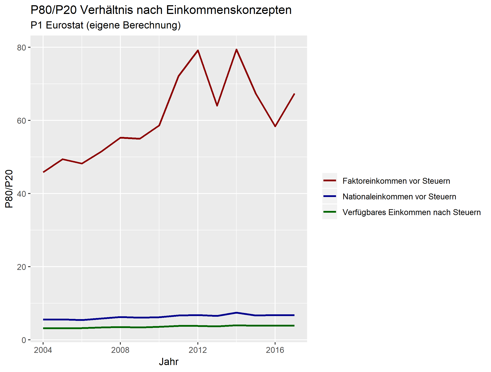
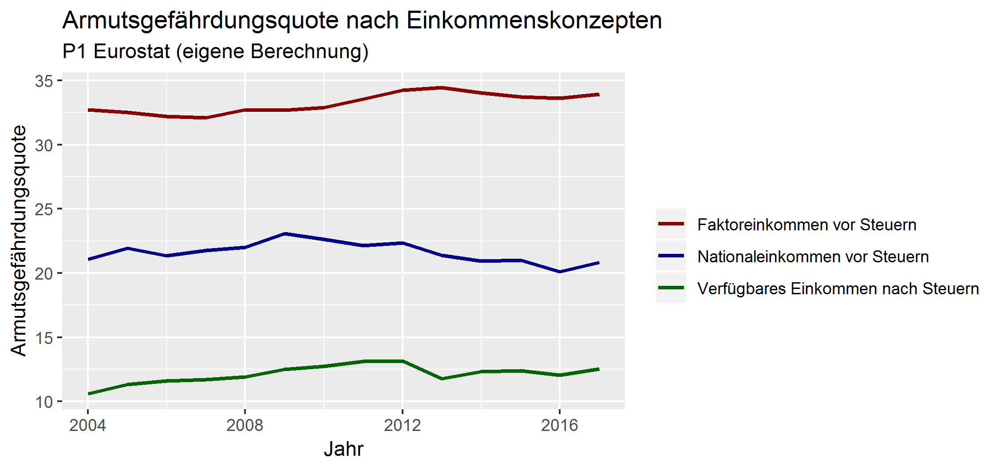

```{r setup, include=FALSE, message = F}
knitr::opts_chunk$set(echo = TRUE)
library(tidyverse)
```


\newpage
# 1 Einführung
Die Strategie Europa 2020 ist die Agenda der Europäischen Union zur Förderung von Wachstum und Beschäftigung des gegenwärtigen Jahrzehntes. Zu der Umsetzung dieses geimsamen europäischen Vorhaben wurden in den Bereichen Beschäftigung, Forschung, Klimawandel, Armut und soziale Ausgrenzung  nationale Ziele festgelegt, die jährlich im Rahmen von Fortschrittsberichten beobachtet werden. Insbesondere soll durch eine Verringerung der Armut, die soziale Eingliederung gefördert werden, wobei angestrebt wird, mindestens 20 Millionen Menschen vor dem Risiko der Armut zu bewahren [@europe2020].

Im Rahmen dieser Vorhaben setzt die EU ein klares Zeichen zur Bekämpfung von Armut. Während Armut per se sich nur auf den untersten Teil der Einkommensverteilung beschränkt, zeigt die Einkommensverteilung das Bild der gesamten betrachteten Volkswirtschaft. Die OECD weist bereits seit mehrere Jahren auf die Spreizung der Einkommen hin [@oecd2008growing; @oecd2015together]. In dem Report „Growing unequal? Income distribution and poverty in OECD countries“ befasst sich die Internationale Organisation mit der Entwicklung der Disparität der Einkommen von 30 Industriestaaten und zeigt auf, dass mindestens seit der Mitte der 1980er eine geringe, jedoch kontinuierliche Erhöhung der Ungleichheit stattgefunden hat. Wird dieser Zeitaum näher betrachtet stellt sich heraus, dass die jeweiligen Regierungen zwar ihre Ausgaben und Steuern erhöht haben, um dieser Dynamik entgegenzuwirken, wohingegen der gewünschte Umverteilungseffekt nur bis Mitte der 1990er Jahre gedämpft werden konnte. In den darauf folgenden Jahren richtete sich die Umverteilungspolitik weniger gezielt auf ärmere Haushalte und führte zu einem wesentlich Anstieg der Ungleichheit. Es wird darauf hingewiesen, dass dies unter anderem ausschlaggebend für die unteschiedlichen Ausprägungen von Ungleichheit in den jeweiligen Ländern sei [@oecd2008growing]. 

Ersichtlich ist, dass eine effiziente nationale Politik Disparitäten entgegensteuern kann und Steuern und Transfers wichtige Säule der Umverteilung sind. Dänemark wird oft als Land dargestellt, dass Wirtschaftlichkeit und soziale Sicherheit erfolgreich umsetzt. Hier stellt sich die Frage, ob sich das dänische Model des Wohlfahrtsstaates auch in der nationalen Einkommensverteilung wiederspiegelt. Um die Einkommensungleichheit und in diesem Zusammenhang die Entwicklung von Armut und sozialer Ausgrenzung in Dänemark sichtbar zu machen, wird eine beurteilende Analyse verschiedener Indikatoren auf Basis von ausgewählten Daten aus der European Union Statistics on Income and Living Conditions (EU-SILC) Erhebung im Rahmen dieses Artikels vorgenommen.

Das nachfolgende Kapitel beschäftigt sich mit den institutionellen und theoretischen Grundlagen des Landes und ermöglicht es die Auswertung der Indikatoren in einen Kontext zu betrachten. Behandelt wird in diesem Zug der dänische Arbeitsmarkt sowie das Steuer und Transfersystem. In Kapitel 3 liegt der Fokus zum einen auf der Herkunft der verwendeten Daten und deren Aufbereitung sowie den verschiedenen Einkommenskonzepten, die zur Analyse herangezogen werden. Außerdem werden hier die Varianten der Zuteilung von Einkommenskomponenten auf die Haushaltsmitglieder thematisiert. Die berechneten Ungleichheitsindikatoren sind in Kapitel 4 visualisiert. Nachdem der Leser sich nun ein Bild über die Einkommensungleichheit in Dänemark verschaffen konnte, beschäftigt sich das Kapitel 6 mit der Frage in wie weit sich Dänemark Richtung dem Ziel der Armutsbekämpfung von der Strategie Europa 2020 bewegt und ob eine positive Tendenz erkennbar ist. Zuletzt, werden alle Erkenntnisse und Ergebnisse im Rahmen des Conclusios reflektiert und zusammengefasst.

# 2 Institutionelle und theoretische Grundlagen
Im folgenden werden verteilungsrelevante Aspekte des dänischen Wohlfahrtsstaates erläutert. Diese umfassen das Flexicurity-Prinzip, die Arbeitslosenunterstützung, aktivierende Maßnahmen, bezahlte Karenz, Kollektivverträge und Einkommenssteuer.

## 2.1 Das Flexicurity-Prinzip
Seit Ausbruch der Ölkrise hatte Dänemark mit anhaltend hohen Arbeitslosenquoten von rund zehn Prozent zu kämpfen. Um dem gegenzusteuern und die Arbeitslosigkeit nachhaltig zu senken, wurde das Flexicurity System schrittweise seit den 1990er Jahren implementiert [@bjorklund2000going]. Flexicurity ist ein Schachtelwort aus Flexibility und Security und ist zum einen durch einen lockeren Kündigungsschutz und andererseits absichernden Maßnahmen für ArbeitnehmerInnen charakterisiert [@oecd2016survey]. 

## 2.2 Arbeitslosenunterstützung
Vor den Reformen der 1990er Jahre gab es in Dänemark de facto keine zeitliche Beschränkung der Arbeitslosenunterstützung. Im ersten Schritt wurde eine maximale Bezugsdauer von sieben Jahren eingeführt. Diese wurde in weiteren Schritten gesenkt. Seit dem Jahr 2016 beträgt die maximale Bezugsdauer zwei Jahre und kann im Ausnahmefall auf drei Jahre verlängert werden. Dies führte dazu, dass heute weniger Personen Arbeitslosenunterstützung beziehen. Anzumerken ist jedoch, dass gleichzeitig die Zahl der SozialhilfeempfängerInnen gestiegen ist. Arbeitslose erhalten in Dänemark einen gewissen Prozentsatz ihres bisherigen Lohnes, die sogenannte Replacement Rate, von der Versicherung ausbezahlt. Die Replacement Rate ist nach Einkommen gestaffelt und beträgt im Durchschnitt rund 60%. Der Höchstsatz für NiedrigverdienerInnen kommt auf 90% in Dänemark. Im OECD-Vergleich sind beide Prozentsätze Spitzenreiter. Die Ansprüche sind bei einer Höhe, die in etwa 60% des Durchschnitsslohns entspricht, gedeckelt und sind somit für BezieherInnen höherer Einkommen im internationalen Vergleich eher niedrig [@gaard2005two, @oecd2016survey].

## 2.3 Aktivierende Maßnahmen
Ein weiteres Charakteristikum der Flexicurity-Politik stellen sogenannte aktivierende Maßnahmen dar. Innerhalb von drei Monaten haben Arbeitslose in Zusammenarbeit mit den Behörden einen Aktionsplan für den beruflichen Wiedereinstieg zu erstellen. Außerdem können Weiterbildungsprogramme und die Annahme vermittelter Stellen vorgeschrieben werden. Wird dies verweigert, so wird die Arbeitslosenunterstützung gekürzt oder gestrichen. Ziel dieser strikten Maßnahmen ist es die Dauer der Arbeitslosigkeit zu senken und sicherzustellen, dass die BezieherInnen bereit sind am Arbeitsmarkt zu partizipieren [@bjorklund2000going, @gaard2005two]. Insgesamt wendet Dänemark rund 1,8% des BIPs für aktive Arbeitsmarktpolitik auf. Auch in diesem Punkt ist Dänemark unter den OECD Staaten führend [@oecd2016survey].

## 2.4 Bezahlte Karenz
Zusätzlich zu den bereits genannten Reformen wurden vergleichsweise großzügige Karenzmodelle ins Leben gerufen. So können ArbeitnehmerInnen nun bezahlte Bildungs- und Elternkarenz von bis zu einem Jahr in Anspruch nehmen. Außerdem wurde eine Sabbaticalsystem eingeführt bei dem ArbeitnehmerInnen 80% der Arbeitslosenunterstützung erhalten. Die durch Karenzen freigeworden Stellen werden nach Möglichkeit zwischenzeitlich mit Arbeitslosen besetzt. Dadurch sollen diese wieder aktiv in den Arbeitsmarkt integriert werden [@bjorklund2000going, @gaard2005two].

## 2.5 Kollektivverträge
Verhandlungen zwischen den Sozialpartnern haben in Dänemark eine lange Tradition, jedoch wurde ihre Bedeutung im Rahmen der Flexicurity-Reformen geschwächt. Während die Kollektivvertragsverhandlungen früher auf nationaler Ebene durchgeführt wurden, finden die Verhandlungen seit Beginn der 1980er Jahre auf Branchenebene statt. In Dänemark wird außerdem zwischen einem Normal- und einem Mindestlohnsystem unterschieden. Im Normallohnsystem wird der Vertrag auf Branchenebene verhandelt und kann auf lokaler Ebene nur mehr geringfügig abgeändert werden, wohingegen das Ergebnis im Mindestlohnsystem als Untergrenze gilt. Der Anteil der vom Mindestlohnsystem abgedeckten AbeitnehmerInnen stieg im Zuge der Reformen um rund 35 Prozentpunkte und lag 1994 bei 85%. Ein gewisses Maß an Koordination blieb bei den Verhandlungen dennoch erhalten, da das verarbeitende Gewerbe üblicherweise mit den Verhandlungen beginnt und diese als Maßstab für die restlichen Verhandlungen herangezogen werden. Die Quote der gewerkschaftlich organisierten ArbeiterInnen blieb im Zuge der Reformen unverändert bei rund 75% [@bjorklund2000going].

## 2.6 Einkommenssteuer
Das dänische Steuersystem unterscheidet grundsätzlich drei Einkommenskategorien:

**- Persönliches Einkommen** Löhne und Gehälter, Einkommen aus selbstständiger Tätigkeit, Pensionen, Arbeitslosenunterstützung

**- Kapitaleinkommen** Zinserträge und -zahlungen, Dividenden, imputierte Mieten (Im Falle hoher Zinsaufwendungen kann das Kapitaleinkommen negativ sein. Imputierte Mieten stellen ein hypothetisches Einkomman dar. Sie bilden die Ersparnisse ab, die sich für Personen ergeben, die in ihrem Eigentum wohnen)

**- Steuerpflichtiges Einkommen** Die Summe von persönlichem und Kapitaleinkommen abzüglich absetzbarer Ausgaben

Sämtliche ArbeitnehmerInnen in Dänemark zahlen einen Arbeitsmarktbeitrag von 8% ihres Bruttoarbeitseinkommens. Dieser wird noch vor der Berechnung des persönlichen Einkommens abgezogen.
Die steuerpflichtigen Einkommen werden auf nationaler Ebene besteuert. Für Einkommen unter 479.600 Dänischen Kronen (DKK) gilt ein Satz von 10,8%, für jene darüber beträgt er 15%. Gemeinden sind ebenso bemächtigt, Einkommenssteuer einzuheben. Der Steuersatz der Gemeinden liegt zwischen 22% und 28%. Zusätzlich haben ArbeitgeberInnen und ArbeitnehmerInnen Sozialversicherungsbeiträge zu zahlen [@oecd2018taxing].

Im OECD-Vergleich werden Einkommen relativ stark besteuert [@gaard2005two], was in Kombination mit einer progressiven Steuer eine starke Umverteilungswirkung der Fiskalpolitik nahelegt. Für Kapitaleinkommen existieren jedoch zahlreiche Ausnahmen, die diesen Effekt abschwächen [@ganghof2007political]. 

# 3 Methodologie
## 3.1 Daten 
Für eine Analyse der Verteilung der Einkommen aus Erwerbstätigkeit in  Dänemark liefert die   Erhebungen  „European  Union  Statistics  on  Income  and  Living
Conditions“ (SILC) hinreichend detaillierte Daten. Ausschließlich für die Inflationsbereinigung werden Daten von EUROSTAT herangezogen.

Erstmals wurde die EU-SILC Erhebung 2003, basierend auf einer freiwilligen Vereinbarung zwischen Eurostat und sechs Mitgliedstaaten (Belgien, Dänemark, Griechenland, Irland, Luxemburg und Österreich) sowie Norwegen durchgeführt. Inzwischen beteiligen sich neben den EU-Mitgliedsstaaten auch Norwegen, Island, die Türkei, die Schweiz, Mazedonien und Serbien an der harmonisierten Stichprobenerhebung von privaten Haushalten [@eurostatweb]. Mit dem Ziel Armut und sozialer Ausgrenzung zu beobachten, dient die Erhebung in diesem Zusammenhang zur Überwachung der Strategie Europa 2020. 

Die EU-SILC Erhebung umfasst multidimensionale Mikrodaten zu Einkommen, Armut, sozialer Ausgrenzung, Wohnraum, Arbeit, Bildung und Gesundheit und liefert zwei Arten von jährlichen Daten [@silcmanual]:

- Querschnittdaten, die einen bestimmten Zeitpunkt beziehungsweise Zeitspanne betreffen und
- Längsschnittdaten über Veränderungen im Zeitablauf auf individueller Ebene.

Anzumerken ist, dass aufgrund der engen Definition von Haushalten, Personen, die in Anstaltshaushalten oder Gemeinschaftsunterkünften leben oder ohne festen Wohnsitz sind, nicht in den Daten erfasst werden.

Wie bereits angeführt, nimmt Dänemark seit der Erstherbung teil. Hervorzuheben ist, dass Dänemark sowie die restlichen nordischen Länder, Holland und Slowenien zu den einzigen Ländern gehören, in welchen die Einkommensstatistiken auf vollständigen Registern basieren [@statdenm]. Die von Statistics Denmark durchgeführte primärstatistische Erhebung wird sowohl mit Hilfe von persönlichen (CAPI - Computer Assisted Personal Interview) und telefonischen (CATI - Computer Assisted Telephone Interview) Interviews als auch computergestützte (CAWI - Computer Assisted Web Interviews) Webinterviews realisiert. In 2012 präsentierte Statistics Denmark erstmals seine Erfahrung mit der Verwendung von CAWI für subjektive Variablen (objektive Informationen werden aus Registern abgerufen) in EU-SILC [@cawi]. Vorteilhaft an diesem Modus der Datenerhebung ist, dass dieser kosteneffizienter sein kann und die Befragten gemäß ihrer eigenen Geschwindigkeit antworten können, was wiederum zu höheren Antwortquoten führen kann. Auf der anderen Seite, kann dieses selbstverwaltende System natürlich zu missverstandenen Antworten führen, da keine Möglichkeit nach Nachfrage besteht. Für diese Arbeit sind diese erhobenen Daten jedoch nicht relevant, da sie in der Pilotphase nur PW010, HS120, HS040 und HS060 betroffen haben [@cawistat].

## 3.2 Einkommenskonzepte
Im Rahmen der Analyse der Einkommensverteilung in Dänemark werden folgende drei Einkommenskonzepte verwendet, um etwaige Unterschiede in der Entwicklung der Indikatoren besser zu verfolgen und Rückschlüsse auf die Herkunft etwaiger Veränderungen der Lebensbedingungen zu ziehen:

**1. Faktoreinkommen vor Steuern**
Das Faktoreinkommen vor Steuern setzt sich aus der Summme aus Arbeitseinkommen inklusive Selbstständiger (PY010G, PY021G, PY050G, HY110G) und Vermögenseinkommen (HY040G, HY090G, PY080G) zusammen. Dieses Einkommenskonzept erfasst somit nur die Einkommen aus aktiver Produktion. Unter der Annahme, dass kein Transfersystem existiert, wird durch dieses Einkommenskonzept eine direkte Verbindung zu den Arbeitsmärkten geschaffen.


**2. Nationaleinkommen vor Steuern**
Das Nationaleinkommen vor Steuern inkludiert neben den Komponenten des Faktoreinkommens vor Steuern  noch Pensionen (PY100G) und Arbeitslosengeld (PY090G). In diesem Einkommenskonzept werden nur arbeitsrelevante Transferzahlungen hinzugezogen, um eine etwaige Verzerung aufgrund von Veränderungen in der Altersstrukturen (Personen in Pension mit keinem beziehungsweise geringem Faktoreinkommen) zu berücksichtigen. Unterschiede in der Entwicklung von Faktoreinkommen vor Steuern und Nationaleinkommen vor Steuern legen Reformen im Bereich der Arbeitslosen- beziehungsweise öffentlichen Pensionsversicherung nahe. 


**3. Verfügbares Einkommen nach Steuern**
Das verfügbare Einkommen nach Steuern inkludiert neben den Komponenten des Nationaleinkommens vor Steuern alle anderen erhaltenen Transferzahlungen (PY110G, PY120G, PY130G, PY140G, HY050G, HY060G, HY070G, HY080G) abzüglich aller direkten Steuern und Sozialversicherungsabgaben (HY120G, HY130G, HY140G). Schließlich zeigt das verfügbare Einkommen nach Steuern wie der Staat die Höhe und Verteilung der verfügbaren Einkommen durch (weitere) monetäre Transfers beeinflussen kann. 

## 3.3 Allokation der Haushaltskomponenten
Wie aus den oberen Konzepten erkenntlich ist, gibt es sowohl Variablen auf Personen- (PY010G) als auch Haushaltsebene (HY110G). Die Einkommenskomponenten beziehungsweise Steuern, die nur auf Haushaltsebene verfügbar sind, werden auf die einzelnen Haushaltsmitgleider aufgeteilt. Die Allokation erfolgt nach folgenden zwei Aufschlüsselungsmethoden:

**1. P1 Eurostat ** Hierbei werden alle Einkommen eines Haushaltes in einem gleichem Maß auf die äquivalten Haushaltsmitglieder aufgeteilt.

**2.  P2 wid.world ** Im Gegensatz zu der vorhergehenden Variante, werden hier nicht mehr alle in einem Haushalt lebenden Personen in das Sample genommen. Hier erfolgt eine Ausschließung von Personen unter 20 Jahren. Außerdem wird lediglich die Einkommensvariable, die nur auf Haushaltsebene verfügbar ist durch die Anzahl der Haushaltsmitglieder (>20) gleichmäßig auf alle Haushaltsmitgleider aufgeteilt; die persönlichen Einkommen bleiben den jeweiligen Personen vorbehalten. 


# 4 Ungleichheitsindikatoren
Im Folgenden wird die Einkommensverteilung in Dänemark  anhand von mehreren standardisierten Indikatoren für den Zeitraum 2004-2017 analysiert, um Rückschlüsse über die Ungleichheit des Landes zu geben. 

In diesem Abschnitt liegt der Fokus der Auswertung auf P1. Begründet wird dies dadurch, dass die Daten über Steuern nur auf Haushaltsebene verfügbar sind. Würden wir beispielsweise die Variante P2 heranziehen, wenn wir eine geringverdienende Frau mit sehr gut verdienenden Mann betrachten, stellt sich heraus, dass sie neben ihrem geringen Einkommen die Steuerlast ihres Mannes in der Einkommensverteilung mitträgt. Sämtliche Gesamtübersichten der berechneten Indikatoren befinden sich für beide Allokationsvarianten, sprich P1 und P2, im Appendix.

## 4.1 Mittelwert und Median
Für einen ersten Eindruck, werden Mittelwert und Median Einkommen näher betrachtet, da diese Aufschluss über die Schiefe der Verteilungsfunktion geben. Die Abbildung 1 zeigt die Entwicklung des Median- und Durchschnittseinkommens nach Steuern (Einkommenskonzept 3) seit 2004.

{width=65%}

Es  fällt  sofort  ins  Auge, dass beide Werte über den Zeitverlauf stark gestiegen sind. Die Betrachtung des durchschnittlichen Jahreseinkommen zeigt von 2004 bis 2017 eine Erhöhung von rund 28.371 DKK auf 33.776 DKK, was knapp 20% entspricht. Für das Medianeinkommen beträgt die Erhöhung in diesem Fall lediglich rund 15%. 


Da das Durchschnittseinkommen deutlich unter dem Medianeinkommen liegt, kann man daraus schließen, dass die Einkommensverteilung eine rechtsschiefe Dichtefunktion ausweist. Dies ist charakteristisch für eine Einkommensverteilung. Aus der Grafik ist gut ersichtlich, dass Dänemark nicht unverschohnt von der Wirtschafts- und Finanzkrise 2008 geblieben ist und sich diese auf die Einkommen privater Haushalte negativ ausgewirkt hat. Diese Annahme wird durch @statdenm2 bestätigt, die auch zeigen, dass Dänemark die Folgen der Krise langsamer kompensiert hat als dessen Nachbarländer.  


## 4.2 Gini Koeffizient
Durch den Vergleich von Median und Mittelwert lassen sich nur beschränkt Schlüsse auf die Einkommensverteilung ziehen. Ein detaillierteres Bild liefert der Gini Koeffizient. Entspricht der Gini einem Wert von Null, liegt vollständige Gleichverteilung vor, nimmt er 1 an, so gehört einer Person das ganze Vermögen in der Gesellschaft. 

{width=65%}

Abbildung 2 zeigt die Entwicklung des Gini Koeffizienten nach den drei Einkommenskonzepten seit 2004. Klar ersichtlich ist,  dass  die  staatlichen Umverteilungssysteme die  
Einkommensungleichheit stark sinken lassen. Dies sieht man beim Vergleich des Ginis für das verfügbare Einkommen nach Steuern mit den beiden anderen Einkommenskonzepten. Sowohl Arbeitslosenunterstützung und Pensionen als auch Steuer- und Transfersysteme lassen die Ungleichheit in einem größeren Ausmaß sinken. Für das Jahr 2017 bedeutet dies eine Senkung von insgesamt 20%. Insgesamt ist im Zeitverlauf die Ungleichheit in Dänemark gestiegen. Außerdem zeigt Tabelle 5 aus dem Appendix, dass der Gini-Koeffizient nach der Berechnung P2 für alle Zeitpunkte deutlich höher ist. Dies erfolgt aus der Konstruktion der Allokationsvariante.


## 4.3 P80/P20 Verhältnis
Das P80/P20 Verhältnis stellt den Mittelwert der oberen 20% relativ zu den unteren 20% der EinkommensbezieherInnen gegenüber.

{width=65%}

Um das P80/P20 Verhältnis für Dänemark zu illustrieren, werden die drei verschiedenen Einkommenskonzepte über den Zeitrahmen 2004-2017 in Abildung 3 betrachtet. Unter der Annahme, dass der mittlere Einkommensteil in diesem Verhältnis ausgeblendet wird, ist dieses Maß wesentlich sensitives bei Veränderungen an den Rändern der Verteilung. Für die Auswertung von Dänemark sieht man, dass der Unterschied zwischen Faktoreinkommen vor Steuern und dem verfügbaren Einkommen nach Steuern zu einem größeren Teil durch das progressive Steuersystem erklärbar ist. Dieses Verteilungsmaß zeigt einen leicht steigenden Trend zu mehr Ungleichheit. Für die verfügbaren Einkommen beträgt das P80/P20 Verhältnis rund 4%. Dies bedeutet, dass eine Person aus den top 20% im Durchschnitt das vier-fache des Einkommens einer Person der unteren 20% verdient.


## 4.4 Top 10% Anteil
Der Top 10% Anteil gibt Auskunft  ob die Einkommen an der Spitze davon laufen.

{width=100%}

Abbildung 4 zeigt die Entwicklung des Top 10% Anteils nach den drei Einkommenskonzepten für beide Allokationsvarianten. Der Anteil der Top 10% ist für die jeweiligen Einkommenskonzepte im Zeitverlauf konstant. Für die verfügbaren Einkommen liegt dieser Wert für P1 im Durchschnitt bei 0,57 und bei P2 0,50. Dies bedeutet, dass die Top-Verdiener die Hälfte des Gesamteinkommens beziehen. Die Einkommenskonzepte Nationaleinkommen vor Steuern und das verfügbare Einkommen nach sind in beiden Varianten P1 und P2, wie zu erwarten, nahezu ident. 


# 5 Armut in Dänemark
Die Strategie Europa 2020 hat es sich zum Ziel gesetzt, mindestens 20 Millionen Menschen vor dem Risiko der Armut zu bewahren. Dementsprechend stehen die jeweiligen Staaten mit ihren abgestimmten nationalen Zielen vor einem großen Ziel. Im folgenden wird analysiert, in wie weit sich Dänemark Richtung dem Ziel der Armutsbekämpfung von der Strategie Europa 2020 bewegt und ob eine positive Tendenz erkennbar ist.
 
## 5.1 Armutsgefährdungsquote
Ein wertvoller Indikator hierbei ist die Armutsgefährdungsquote. Diese zeigt den Anteil jener, die  aufgrund ihres relativ geringen Einkommens von Armut und sozialer Ausgrenzung bedroht sind. Nach dem EU-Standard entspricht diese Quote dem Anteil der Personen, deren Äquivalenzeinkommen weniger als 60% des Medians der Äquivalenzeinkommen der Bevölkerung beträgt. Daraus ist ersichtlich, dass die Armutsgefährdungsquote nur relativ betrachtet werden kann und häufig (nicht zwanghaft) auf einen niedrigen Lebensstandard der Betroffenen hin.

{width=90%}

Abbildung 4 zeigt die Entwicklung der Armutsgefährdungsquote nach den drei Einkommenskonzepten für P1. Insgesamt ist die Armutsgefährdungsquote über den Zeitverlauf gestiegen. Unter alleiniger Betrachtung des verfügbaren Einkommens nach Steuern ist hier ein Anstieg von 1,95% in dem Zeitraum 2004-2017 beobachtbar. Zwar kann Dänemark im EU-Vergleich eine gerine Armutsgefährdungsquote per se aufweisen, dennoch bewegt sich das Land noch nicht in die richtige Richtung für die Strategie Europa2020. Dies bedeutet, dass die 2010 von Europäischen Rat verabschiedeten Zielvorgaben die bis 2020 erfüllt werden sollten, in weitere Ferne rücken. Vergleichen wir 2010 mit den neuesten Werten von 2017 (im Detail siehe Appendix) ist kaum eine Veränderung der Rate beobachtbar.

## 5.2 Zerlegung der Armutsgefährdungsquote
Die Zerlegung der Armutsgefährdungsquote nach Geschlecht zeigt folgendes Bild:

```{r echo=FALSE, message = F, warning=F}
# Read CSV data, "../../" to look two levels upwards
table <- read_csv("tables/gender_tab.csv")
table <- table %>%
  rename( Einkommenskonzept = X1)
knitr::kable(table, caption = "Zerlegung Armutsgefährdungsquote nach Geschlecht (2015)")
```

Die Zerlegung der Armutsgefährdungsquote nach Alter zeigt folgendes Bild:
```{r echo=FALSE, message = F, warning=F}
# Read CSV data, "../../" to look two levels upwards
table <- read_csv("tables/age_tab.csv")
table <- table %>%
  rename( Einkommenskonzept = X1)
knitr::kable(table, caption = "Zerlegung Armutsgefährdungsquote nach Alter (2015)")
```


# 6 Conclusio
kkk


\newpage

# Appendix
**Legende**

- i11:  Faktoreinkommen vor Steuern nach P1 Eurostat
- i12:  Nationaleinkommen vor Steuern nach P1 Eurostat
- i13:  Verfügbares Einkommen nach Steuern nach P1 Eurostat
- i21:  Faktoreinkommen vor Steuern nach P2 wid.world
- i22:  Nationaleinkommen vor Steuern nach P2 wid.world
- i23:  Verfügbares Einkommen nach Steuern nach P2 wid.world
- DS:  Denmark Statistics

&nbsp;

**Gesamtübersichten der Indikatoren**
```{r echo=FALSE, message = F, warning=F}
# Read CSV data, "../../" to look two levels upwards
table <- read_csv("tables/mean.csv")
table <- table %>%
  rename(Jahr = X1) %>% select(-c(Statbank_prim_a, Statbank_prim_b, Statbank_disp_a, Statbank_disp_b, Statbank_pre_tax_a, Statbank_pre_tax_b))
knitr::kable(table, caption = "Gesamtübersicht Mittelwert")
```


```{r echo=FALSE, message = F, warning=F}
# Read CSV data, "../../" to look two levels upwards
table <- read_csv("tables/median.csv")
table <- table %>%
  rename(Jahr = X1, DS = Statbank, i11 = statistic, i12 = statistic.1, i13 = statistic.2, i21 = statistic.3,i22 = statistic.4, i23 = statistic.5)
knitr::kable(table, caption = "Gesamtübersicht Median")
```


```{r echo=FALSE, message = F, warning=F}
# Read CSV data, "../../" to look two levels upwards
table <- read_csv("tables/gini.csv")
table <- table %>%
  rename(Jahr = X1, DS = Statbank)
knitr::kable(table, caption = "Gesamtübersicht Gini-Koeffizienten")
```


```{r echo=FALSE, message = F, warning=F}
# Read CSV data, "../../" to look two levels upwards
table <- read_csv("tables/8020.csv")
table <- table %>%
  rename(Jahr = X1, DS = Statbank)
knitr::kable(table, caption = "Gesamtübersicht P80/P20 Verhältnis")
```


```{r echo=FALSE, message = F, warning=F}
# Read CSV data, "../../" to look two levels upwards
table <- read_csv("tables/t10.csv")
table <- table %>%
  rename(Jahr = X1, i11 = statistic, i12 = statistic.1, i13 = statistic.2, i21 = statistic.3,i22 = statistic.4, i23 = statistic.5)
knitr::kable(table, caption = "Gesamtübersicht Top 10% Anteil")
```


```{r echo=FALSE, message = F, warning=F}
# Read CSV data, "../../" to look two levels upwards
table <- read_csv("tables/arpr.csv")
table <- table %>%
  rename(Jahr = X1, DS = Statbank, i11 = i11_arpr, i12 = i12_arpr, i13 = i13_arpr, i21 = i21_arpr,i22 = i22_arpr, i23 = i23_arpr)
table$Jahr <- 2004:2017
knitr::kable(table, caption = "Gesamtübersicht Armutsgefährdungsquote")
```

\newpage
# Literatur
<!-- Leer lassen -->